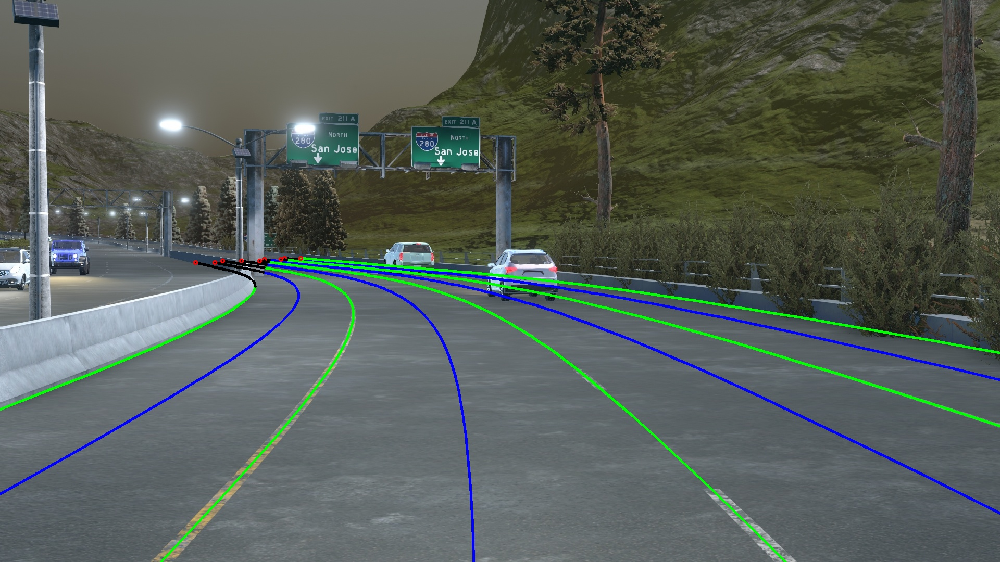
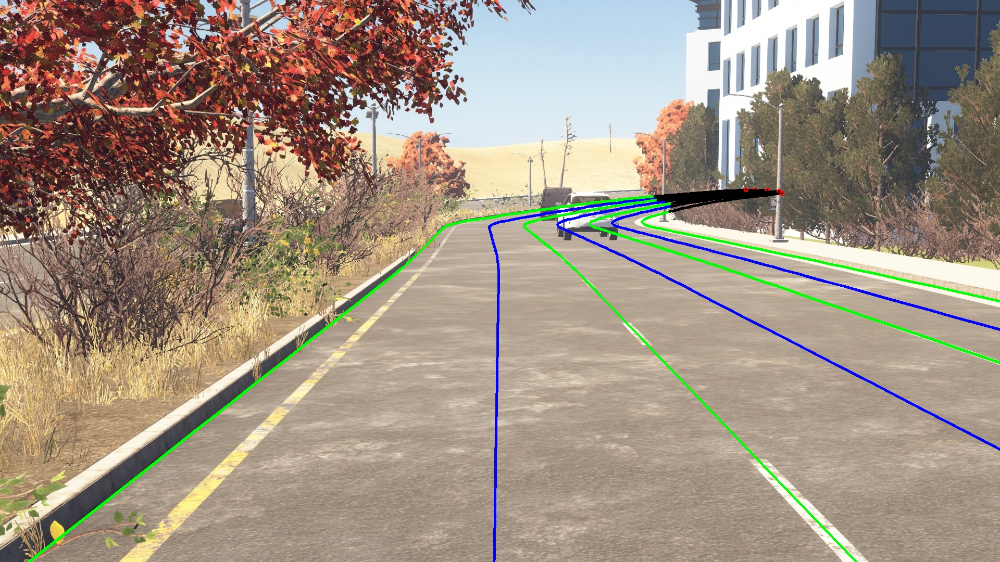

# A Simulated Dataset for 3D lane Detection

## Introduction

This is a simulated dataset constructed to stimulate the development and evaluation of 3D lane detection methods 
(download from [here](https://drive.google.com/open?id=1Kisxoj7mYl1YyA_4xBKTE8GGWiNZVain)). 
This dataset is an extension to [Apollo Synthetic Dataset](http://apollo.auto/synthetic.html).
The detailed strategy of the construction and evaluation method refer to our paper:

"Gen-LaneNet: A Generalized and Scalable Approach for 3D Lane Detection", Y. Guo, etal., 2020

<p align="center">
  
   
  
</p>


## Requirements

* python                    3.7.3
* numpy                     1.16.2
* scipy                     1.2.1 
* matplotlib                3.0.3 
* opencv-python             4.1.0.25
* py3-ortools               5.1.4041


## Data preparation


You are wellcome to proceed to the development and evaluation directly using the splits of training and testing sets we provide.
Feel free to skip this section if you use our data split directly.

    ```
    data_splits
    ├── standard
    │   ├── 3D_LaneNet
    |   |       └──test_pred_file.json
    │   ├── Gen_LaneNet
    |   |       └──test_pred_file.json
    │   ├── train.json
    │   └── test.json
    │── rare_subset
    │   ├── 3D_LaneNet
    |   |       └──test_pred_file.json
    │   ├── Gen_LaneNet
    |   |       └──test_pred_file.json
    │   ├── train.json
    │   └── test.json
    |── illus_chg
    │   ├── 3D_LaneNet
    |   |       └──test_pred_file.json
    │   ├── Gen_LaneNet
    |   |       └──test_pred_file.json
    │   ├── train.json
    │   └── test.json
    ```

Meanwhile, we provide the helper functions needed to build your own split from the raw datasets downloaded. The following codes 
need to be right in order.

    parse_apollo_sim_raw_data.py

This code extracts lane-lanes and center-lanes in a interested top-view area. The code reasons about the foreground and background
occlusion based on the provided ground-truth depth maps and semantic segmentation map. Those lane segments in the distance occluded
by background are discarded, because in general they are not expected to recover from a lane detection method.

    prepare_data_split.py

This code randomly split the whole data into training and testing sets following a 'standard' five-fold split. Specifically, 
a subset generated from a difficult urban map are further extracted to be the test set for 'rare subset' data split.

    prepare_data_subset
 
Given the standard split of data, this code exclude images corresponding to a certain 'illumination' condition (before dawn)
from the training set. On contrary, in the testing set, only images corresponding to that illumination condition are kept.


## Evaluation

    eval_3D_lane.py
    
You need to modify 'method_name', 'data_split' to specify which method and under which data split to conduct the evaluation. 
Optionally, set 'args.dataset_dir' to the folder saving the original dataset. The original images are only required for visualizing lane results, when setting 'vis = True'.

In this dataset, each image sample is associated with a set of ground-truth 3D lane-lines and center-lines, as well as 
the camera height and pitch angle. 
Per image, the optimal matching between a set of predicted lane curves  a set of ground-truth lane curves.
Precision and recall are computed via varying lane confidence threshold. Overall, evaluation metrics include:
 * Average Precision (AP)
 * max F-score
 * x-error in close range (0-40 m)
 * x-error in far range (40-100 m)
 * z-error in close range (0-40 m)
 * z-error in far range (40-100 m)


## Baselines Results

We show the evaluation results comparing two baseline methods. 
* "3d-lanenet:  end-to-end 3d multiple lane detection", N. Garnet, etal., ICCV 2019
* "Gen-LaneNet: A Generalized and Scalable Approach for 3D Lane Detection", Y. Guo, etal., 2020

Comparisions are conducted under three distinguished splits of datasets. For simplicity, only laneline results are reported here.
The results from the code is slightly different from reported in the paper due to different random splits.

- **Standard**

| Method                 | AP     | F-Score | x error near (m) | x error far (m) | z error near (m) | z error far (m) |
|------------------------|:---------:|:---------:|:---------:|:---------:|:---------:|:---------:|
| 3D-LaneNet             |   89.3    | 86.4      | 0.068     | 0.477     | 0.015     | 0.202
| Gen-LaneNet            |   90.1    | 88.1      | 0.061     | 0.496     | 0.012     | 0.214

- **Rare Subset**

| Method                 | AP     | F-Score | x error near (m) | x error far (m) | z error near (m) | z error far (m) |
|------------------------|:---------:|:---------:|:---------:|:---------:|:---------:|:---------:|
| 3D-LaneNet             |  74.6     | 72.0      | 0.166     | 0.855     | 0.039     | 0.521
| Gen-LaneNet            |  79.0     | 78.0      | 0.139     | 0.903     | 0.030     | 0.539

- **Illumination Change**

| Method                 | AP     | F-Score | x error near (m) | x error far (m) | z error near (m) | z error far (m) |
|------------------------|:---------:|:---------:|:---------:|:---------:|:---------:|:---------:|
| 3D-LaneNet             |   74.9    | 72.5      | 0.115     | 0.601     | 0.032     | 0.230
| Gen-LaneNet            |   87.2    | 85.3      | 0.074     | 0.538     | 0.015     | 0.232


## Visualization

Visual comparision to the ground truth can be generated per image when setting when setting 'vis = True'.
We show two examples for each method under the data split involving illumination change.

* 3D-LaneNet

 

* Gen-LaneNet

 
